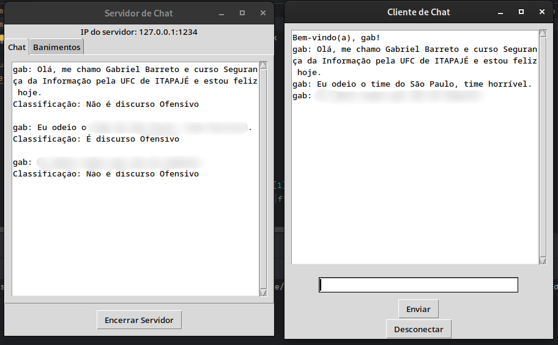

## Chat em Python com Identificador de Discurso de Odio com auxilio do BERTimbau e Dataset HATE-BR.

#### Olá, me chamo Gabriel Barreto e sou estudante de Segurança da Informação pela Universidade Federal do Ceará - Campus Jardins de Anita. Hoje, lhes apresento o seguinte projeto que desenvolvi ao longo de minha graduação com apoio do Dr. Prof. Juan Sebastian Toquica, docente pela mesma universidade.

  O seguinte ReadMe (leia-me) detalha como se deu a criação do projeto em questão que se baseia em um chat interativo feito na linguagem de programação Python. O referido, funciona via IntraNet (Rede Interna) onde o usuário que deseja se conectar é requerido seu nome de usuário e o IP (Internet Protocol) do servidor. Esse por sua vez, o servidor, acompanha o chat de maneira ineterrupta durante toda a comunicação entre os usuários, apelidamos eles de clientes para melhor entendimento do processo de criação dos códigos.
  
  Esse projeto tem por finalidade, além de promover a comunicação entre dois usuários ou mais um ambiente social saudável. Visto que o foco do mesmo se fundamenta no combate ao discurso de ódio, por ventura o mesmo traz consigo consequências danosas se assim for deixado somente como pauta do debate filosófico. Tais medidas, tem como fim tornar a comunicação acolhedora para todos os seus participantes para que assim possamos almejar com um futuro menos danosos a todos.

### Funcionalidades Disponíveis (atualizado até 12/08/2024):

- Cliente(s) e servidor se conectam através de um IP e portas pré-definidos via código Python (Ambos mostrados na tela do servidor);
- Envio de mensagens de um para o outro, ambos os conectados podem observar as mensagens;
- Mensagem de Boas-vindas quando um novo cliente se conecta;
- Acompanhamento do Bate-papo pelo servidor;
- Registro do Bate-papo em um arquivo *.txt contendo: Data e Hora de todas as mensagens para posterior análise pelo administrador do servidor - apenas a titulo de “auditoria” posteriormente pelo administrador;
- Banimento manual pelo servidor tanto por IP (ainda a ser implementado, visto que o chat é somente IntraNet e tal funcionalidade não há ainda a urgência para ser realizada, restringindo-se somente ao banimento por nome) do cliente conectado quanto pelo seu nome de usuário, impossibilitando que este venha a se conectar em caso de alterar o nome ou variação do nome em caso de banimento tente se reconectar ao servidor - letras maiúsculas ou minusculas como exemplo. ex: gabriel; gAbriel);
- Tentativas falhas de conexão do usuário banido são mostradas na aba reservada ao servidor.
- Regionalismo para com palavras que possuam duplo sentido da região Nordeste;
- As mensagens são analisadas pelo BERTimbau (classificador) e é exibiido na tela do servidor sua respectiva classificação, como sendo 0 - Negativo, 1 - Positivo, ou se nenhum dos conceitos assim se aplicar, é classificado como sentimento neutro.
- Além da funcionalidade citada acima, a respeito do classificador de sentimentos (positivos, negativos e/ou neutros) o BERTimbau foi usado para dar ênfase e combater o discurso de ódio, visto que o mesmo, aplica uma multa (funcionalidade implementada posteriormente) ao usuário que assim optar por continuadamente insistir em usar dessa linguagem;

### Observações:
- 1ª. É entendido que, apesar de todo o esforço dedicado a este projeto, o dataset hate-br reaproveitado não comporta totalmente todas as possibilidades existentes de como uma palavra ou conjunto de frases tendem a se apresentar em meio a um contexto complexo na rede, isso posto, entende-se que muitas frases ainda apresentem divergência quanto ao entendimento humano e seu real significado se comparado a como a linguagem humana defina como fixa ou não alterável;

- 2ª. O projeto tem como data final (30/09/2024), salientando que é a data aproximadada de término de minha graduação no curso citado anteriormente no começo desse ReadMe (Leia-me);

### Como usar:
- Primeiramente, Inicialmente é necessário que você inicie o servidor através do arquivo 'servidor.py', saliento que você necessita da versão atual do Python3 ou superior, ele será o seu interpretador de código. Além disso, fica de forma opcional você usar um IDE ou gráfica para rodar os códigos aqui disponibilizados, aplicando as permissões de execução (Linux ou Windows) o arquivo abre uma janela de dialogo automáticamente contendo o referido chat. O mesmo possui duas abas interativas, onde uma é a 'Página Inicial' ou particularmente apelidada de 'Home' e a outra serve para acompanhamento de banimentos, além de acompanhar as tentivas falhas de conexão de usuários banidos do servidor, fornecendo o 'IP' e 'Nome' de quem por ventura está repentinamente tentando conexão com o servidor apesar de seu banimento.

- Segundamente, após iniciar o servidor, você poderá executar os arquivos referentes aos clientes, nomeados como 'cliente_1.py' ou superiores, os arquivos de cliente estão disponíveis de forma dual, mas os dois arquivos tanto o 'cliente_1.py' quanto o 'cliente_2.py' possuem o mesmo código, sem alterações. Quanto a posição ou número do cliente, isso pouco importa no projeto como um todo, foi feita essa identificação inicial para permitir que possamos ter noção mínima de quem foi o primeiro ou segundo cliente a se conectar, assim sendo, é possível quase números inifinitos de clientes neste chat. Mas, por motivos de teste base, foi delimitado para somente 5(cinco) usuários simultâneos conectados de forma conjunta, em caso de uma tentativa além das permitidas, é enviada uma mensagem de alerta para o novo usuário.

- Por fim, com ambos os arquivos abertos, você deverá Informar nos 'clientes_x.py' seu nome de usuário, nome desejado para uso, IP do servidor e porta de conexão. Lembrando que o mesmo ainda funciona em rede local, sem depender de um servidor externo para seu pleno funcionamento;

- Depois de você ter realizado todos esses procedimentos, você estará apto a usar o chat. :D

- Abaixo podemos verificar o chat em pleno funcionamento, junto com a classificação do discuro analisado.

- Por fim, temos algumas métricas(bases):
- 

- Por fim, saliento que ainda há de se desenvolver métricas bases como acurácia, f1-score dentre outras, ainda em processo de desenvolvimento.
